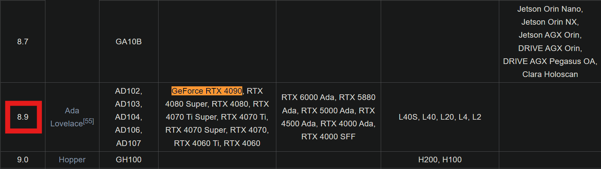
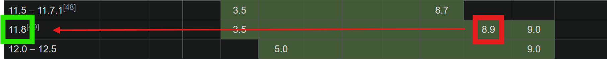
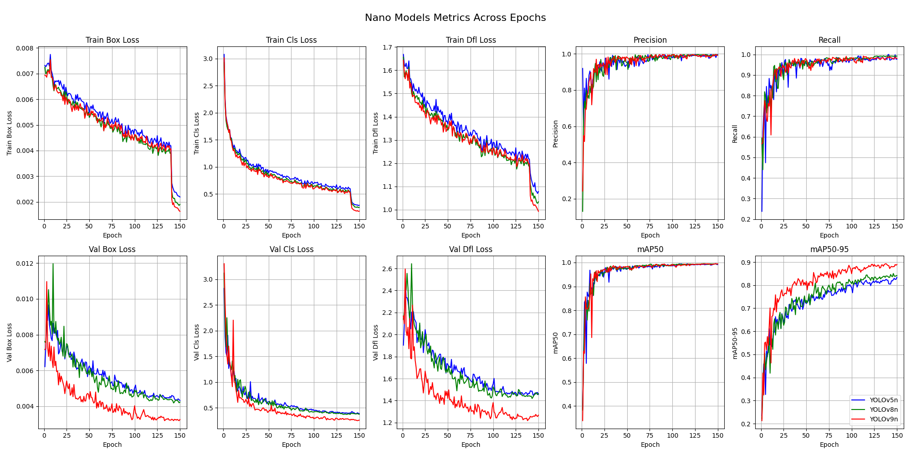
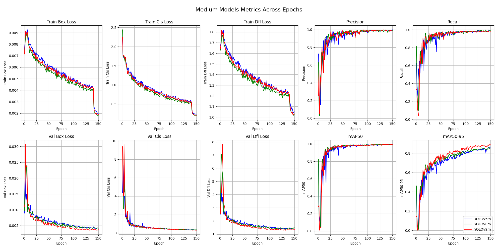
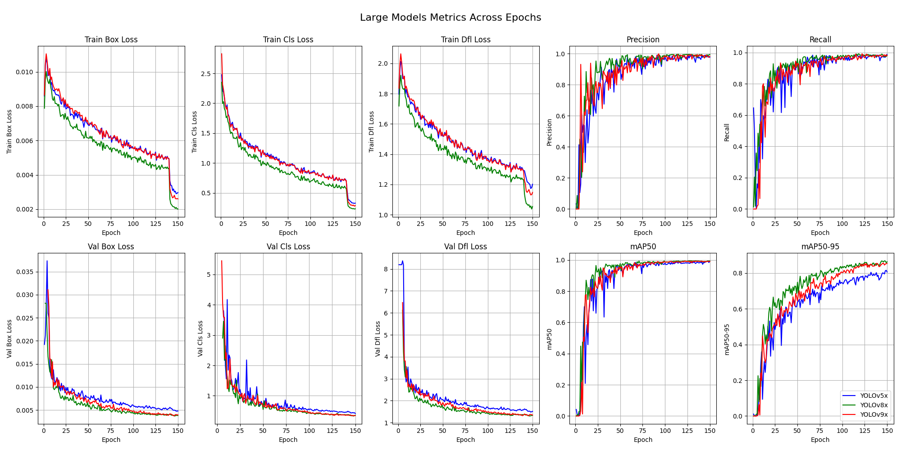
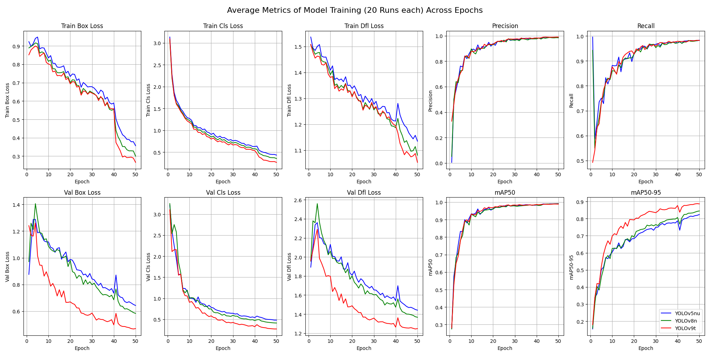
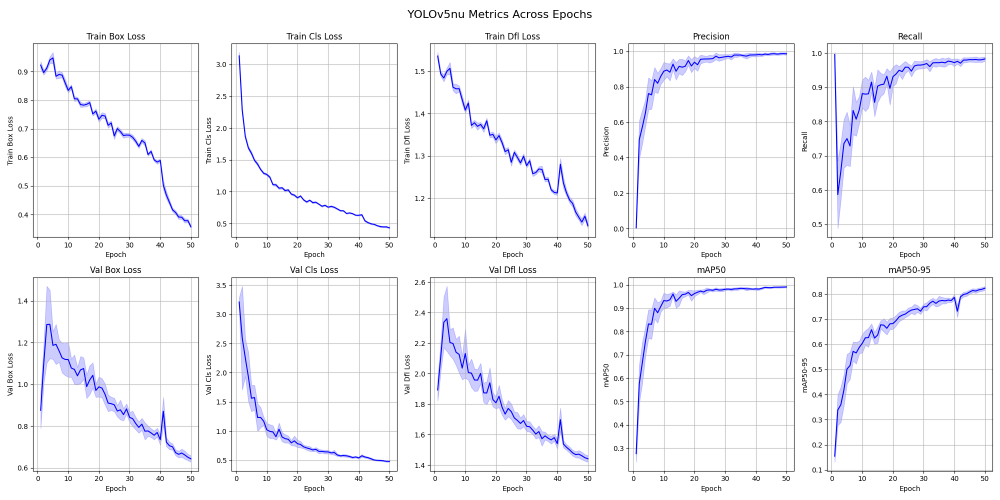
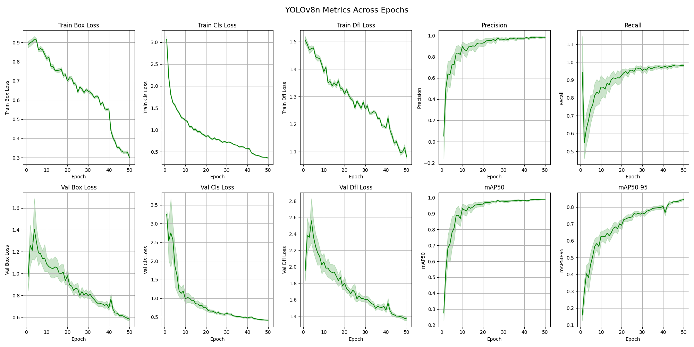
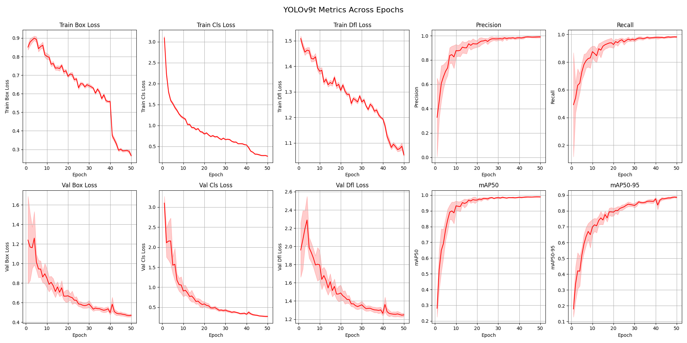

<style>
  table {
    width: 100%;
    border-collapse: collapse;
  }
  th, td {
    border: 1px solid black;
    padding: 8px;
    text-align: left;
  }
  th {
    background: grey;
    color: white;
    text-align: center;
  }

  .variants {
    text-align: center;
    margin: auto;
    border-collapse: collapse;
    th, td { 
        border: 1px solid black;
        padding: 8px;
        text-align: center;
    }
    th, td:first-child {
        background: grey;
        color: white;
    }
    td:nth-child(2), td:nth-child(5), td:nth-child(8), td:nth-child(11) { 
        background: #D3EAF7; /* Light Blue for YOLOv5 */
        color: black;
    }
    td:nth-child(3), td:nth-child(6), td:nth-child(9), td:nth-child(12) { 
        background: #E8F6E8; /* Light Green for YOLOv8 */
        color: black;
    }
    td:nth-child(4), td:nth-child(7), td:nth-child(10), td:nth-child(13) { 
        background: #F9E79F; /* Light Yellow for YOLOv9 */
        color: black;
    }
  }

  .parameters {
    th { background: grey; }
    color: black;
    .data { background-color: #ffcccc; color: black }
    .training { background-color: #ccffcc; color: black }
    .learning { background-color: #ccccff; color: black }
    .loss { background-color: #ffffcc; color: black }
    .augmentation { background-color: #ffebcc; color: black }
    .additional { background-color: #ccffff; color: black }
  }

  .default {
    th { background: grey; }
    td { background-color: #c5c5c5; color: black; }
    color: black;
  }
  
  .images {
    text-align: left;
    max-width: 1000px;
  }
</style>

# Project: Comparison of YOLO models

## Table of Contents
- [Prerequisites](#prerequisites)
- [Image Acquisition](#image-acquisition)
- [Image Labeling](#image-labeling)
  - [Labeling Process (LabelImg)](#labeling-process-labelimg)
  - [Labeling Process (Labelbox)](#labeling-process-labelbox)
- [Label Conversion](#label-conversion)
  - [Convert to YOLO](#convert-to-yolo)
  - [Dataset Split](#dataset-split)
- [Ultralytics YOLO (You Only Look Once)](#ultralytics-yolo-you-only-look-once)
  - [YOLO Models](#yolo-models)
  - [How YOLO Models Function](#how-yolo-models-function)
  - [Challenges and Limitations](#challenges-and-limitations)
  - [YOLOv5](#yolov5)
  - [YOLOv8](#yolov8)
  - [YOLOv9](#yolov9)
  - [YOLOv5 vs. YOLOv8 vs. YOLOv9 model variants](#yolov5-vs-yolov8-vs-yolov9-model-variants)
  - [Conclusion](#conclusion)
  - [References](#references)
- [Training on Nvidia GPU](#training-on-nvidia-gpu)
  - [CUDA](#cuda)
  - [PyTorch](#pytorch)
- [YOLO Training Process](#yolo-training-process)
  - [1. Dataset Configuration File](#1-dataset-configuration-file)
  - [2. Training Script](#2-training-script)
  - [3. Run Training](#3-run-training)
  - [Training Parameters](#training-parameters)
- [Training Results](#training-results)
  - [Nano Variants](#nano-variants)
  - [Medium Variants](#medium-variants)
  - [Extra-Large Variants](#extra-large-variants)
  - [Nano Variants - Multiple Runs](#nano-variants---multiple-runs)
  - [Metrics](#metrics)
- [Interpretation of Training Results](#interpretation-of-training-results)
  - [Interpretation of 20 runs](#interpretation-of-20-runs)
  - [Model Versions Compared](#model-versions-compared)

## Prerequisites
Python 3.12 or higher.

Set up and activate Python environment
```bash
python -m 'venv' .venv
.\.venv\Scripts\activate
```
The Python environment needs to be active for most of this project.

Install dependencies
```bash
pip install -r requirements.txt
```

#### CUDA GPU Training
You will need Nvidia's CUDA Toolkit, compatible with your GPU: [download](https://developer.nvidia.com/cuda-downloads). For more details about selecting 
the correct CUDA SDK toolkit version and training on an Nvidia GPU see chapter [Training on Nvidia GPU](#training-on-nvidia-gpu).


## Image Acquisition
This section deals with the acquisition of images and is located in the [download_images](download_images) directory.
You need to navigate to this directory to run the commands in this section.
```bash
cd ./download_images
```

The easiest way to acquire a dataset for object detection would be to download a dataset from one of the various providers out there.
* Roboflow: https://public.roboflow.com/object-detection/
* Kaggle: https://www.kaggle.com/datasets
* Papers with Code: https://paperswithcode.com/datasets?task=object-detection

Most of the time, you can even download the dataset in the appropriate annotations format for the model you intend to use.

For this project I did the image collection myself and provided the used python scripts ([google](download_images/image_scraper_google.py) and [unsplash](download_images/image_scraper_unsplash.py))
Both of these scripts are using the [BeatifulSoup](https://www.crummy.com/software/BeautifulSoup/) Python package to scrape a specific website for images.

The Google version uses [Google Image Search](https://www.google.de/) and downloads the preview images for all search results.

The Unsplash version uses the [Unsplash Image Search](https://unsplash.com/) and downloads the full images for all search results.

<div class="default" style="max-width:500px">
<table>
  <tr>
    <th></th>
    <th>Google</th>
    <th>Unsplash</th>
  </tr>
  <tr class="default">
    <th>Advantage</th>
    <td>Many images</td>
    <td>High resolution</td>
  </tr>
  <tr class="default">
    <th>Disadvantage</th>
    <td>Low resolution</td>
    <td>Few images</td>
  </tr>
</table>
</div>

Run the Google scraper:
```bash
python ./image_scraper_google.py
```

Run the Unsplash scraper:
```bash
python ./image_scraper_unsplash.py
```

The images will be saved to the appropriate subdirectory in [birds_dataset](download_images/birds_dataset). Naturally, some images won't be of the correct motif, 
but because you'll have to review every picture once more while labeling, there's no need to sort them out now.


## Image Labeling
This section deals with the label process of the previously downloaded images and is located in the [model_training](model_training) directory.
You need to navigate to this directory to run the commands in this section.
```bash
cd ./model_training
```

There are many different tools and websites available for annotating images.
* LabelImg: https://github.com/HumanSignal/labelImg
* VGG Image Annotator (VIA): https://www.robots.ox.ac.uk/~vgg/software/via/
* Labelbox: https://labelbox.com/
* Computer Vision Annotation Tool (CVAT): https://github.com/cvat-ai/cvat

Many of these tools have automatic annotation options available.

### Labeling Process (LabelImg)
LabelImg has a user-friendly GUI that allows you to open files and folders, has a straightforward labeling process, and enables you to export labels in various formats.

The following commands are run from the root of this repository.

Install LabelImg
```bash
pip install labelImg
```

Run LabelImg
```bash
labelImg
```

#### Issue with Python 3.10 and later
Currently, the pip version of LabelImg is incompatible with Python 3.10 and later. As described in [GitHub issue #811: 
Unable to draw annotations on Windows](https://github.com/HumanSignal/labelImg/issues/811). Fortunately the issue is fixed in the GitHub version
if you run into this issue simply use the latest GitHub repository instead of the pip version.
```bash
git clone https://github.com/tzutalin/labelImg.git
cd labelImg
```

Compile the resources
```bash
pyrcc5 -o libs/resources.py resources.qrc
```

Run LabelImg
```bash
python labelImg.py
```

### Labeling Process (Labelbox)
This part is dedicated to [Labelbox](https://labelbox.com/), an online tool which lets you add the labels easily.

After Labeling all images you can export the data which lets you download a labelbox_annotation.ndjson file.
This file needs to be processed in order to use it for [YOLO Training Process](#yolo-training-process) in this project.


## Label Conversion
After the annotation of the images is done you sometimes don't have the annotation in the correct format right away.
For [training with YOLO](#yolo-training-process), you need to convert the format to the one specified here.

### Convert to YOLO
The conversion script can be found in the [model_training](model_training) directory.
```bash
cd model_training
```

Required file structure in YOLO:
```bash
dataset/
├── images/
│   ├── train/
│   │   ├── img1.jpg
│   │   └── ...
│   ├── val/
│   │   └── ...
│   └── test/
│       └── ...
└── labels/
    ├── train/
    │   ├── img1.txt
    │   └── ...
    ├── val/
    │   └── ...
    └── test/
        └── ...
```

Required annotation format in YOLO (Textfiles):
```bash
<object-class> <x_center> <y_center> <width> <height>
```

#### From LabelImg
There is no need to convert the labels from LabelImg to YOLO format because LabelImg allows you to export the annotations in the correct format.

#### From Labelbox
The script uses the images from [download_images/birds_dataset](download_images/birds_dataset) ([Image Acquisition](#image-acquisition)) 
and the annotation file downloaded from Labelbox (.ndjson). The final results (images and annotations) will be stored in a folder called annotations by default.
Since all the information about each image is stored in the .ndjson file we can parse this information to fit the required annotation format for YOLO.
```bash
python convert_label_labelbox.py
```

The script loads the Labelbox annotation file, extract the necessary information about the name of the image and position of the bounding box. 
Use this data to create a new text file with the same name as the image, and write the bounding box information into the text file according to YOLO requirements.
It creates a new subdirectory in `output_dir` for each subdirectory found in `images_base_dir`. Now it copies the images and textfiles into their respective subdirectory.


### Dataset Split
To create a dataset according to the YOLO requirements, we need to split it into three distinct subsets: train, val, and test. 
Additionally, we must organize the images and labels into different subdirectories following the [required file structure](#convert-to-yolo) in YOLO. 
The script [dataset_split.py](model_training/dataset_split.py) will perform this split as follows:
* train: 70%
* val: 20%
* test: 10%

Adjust the `dataset_dir` variable in the script to the location where you have stored the labeled images (image and text files).

Split the dataset:
```bash
python dataset_split.py
```


## Ultralytics YOLO (You Only Look Once)
Ultralytics YOLO (You Only Look Once) models are a family of convolutional neural networks designed for real-time object detection. 
They are widely used in various applications due to their speed and accuracy. The primary purpose of YOLO models is to detect objects 
within an image or video stream and classify them into predefined categories. This involves identifying the location (bounding box) 
and the category (class label) of each object present in the scene. [1]

### YOLO Models
There are multiple versions of YOLO models, and newer versions are typically improvements over previous ones. In this project, YOLOv5, YOLOv8, and YOLOv9 are highlighted. 
Each version offers five different variants to support a wide range of applications. The smallest variant is designed for small, battery-powered, non-critical applications, 
while the largest model is intended for highly precise, non-power-dependent applications.

### How YOLO Models Function
1. **Single Shot Detection**\
YOLO models perform object detection in a single shot. Unlike traditional methods that use a sliding window approach to scan an 
image at multiple scales and locations, YOLO divides the image into a grid and predicts bounding boxes and class probabilities directly.
2. **Grid-Based Approach**
   * Image Division: The input image is divided into an SxS grid.
   * Bounding Box Prediction: Each grid cell predicts a fixed number of bounding boxes.
   * Confidence Score: Each bounding box comes with a confidence score that indicates the likelihood of an object being present and the accuracy of the bounding box coordinates.
   * Class Probability: Each grid cell also predicts class probabilities for the object within it.
3. **Intersection Over Union (IoU)**\
YOLO uses IoU to evaluate the overlap between predicted bounding boxes and ground truth boxes. This helps in determining the accuracy 
of the predictions and in eliminating redundant boxes through non-max suppression.
4. **Neural Network Architecture**\
YOLO models use a convolutional neural network (CNN) to process the input image and produce the predictions. The architecture typically involves:
   * Feature Extraction: Initial layers of the network extract features from the input image.
   * Detection Head: Later layers predict bounding boxes, confidence scores, and class probabilities.

### Challenges and Limitations
* **Small Object Detection**: YOLO models may struggle with detecting very small objects due to the grid-based approach.
* **Localization Accuracy**: The speed of YOLO can sometimes come at the cost of localization accuracy, especially in complex scenes with multiple overlapping objects.
* **Training Data**: The performance of YOLO heavily depends on the quality and diversity of the training data. Insufficient or biased training data can lead to poor generalization.

### YOLOv5
* **Release Date**: 2020
* **Framework**: Built on the PyTorch framework.
* **Key Features**:
  * Ease of Use: Simplified training and deployment with user-friendly configuration files.
  * Auto-Anchor Optimization: Automatically calculates optimal anchor boxes during training.
  * Advanced Data Augmentation: Uses mosaic augmentation to enhance model robustness.
  * Export Options: Supports exporting models to formats like ONNX, CoreML, and TensorRT for diverse deployment scenarios.
* **Performance**: Known for its speed and ease of use, making it a popular choice. \[2] \[7]

### YOLOv8
* **Release Date**: 2023
* **Framework**: Continuation on YOLOv5's framework with improvements.
* **Key Features**:
  * Instance Segmentation: Adds the capability to segment objects at the pixel level, useful for tasks like semantic segmentation.
  * Pose Estimation: Can estimate the orientation or pose of detected objects, beneficial for applications in sports analysis and augmented reality.
  * YOLO-World Model: Introduces open-vocabulary detection, allowing identification of objects using descriptive texts.
  * Unified Framework: Combines object detection, instance segmentation, and image classification in a single, unified framework.
* **Performance**: Faster and more accurate than YOLOv5, with added functionalities for broader use cases. \[3] \[7] \[8] \[9]

### YOLOv9
* **Release Date**: 2024
* **Framework**: Incorporates significant architectural advancements over YOLOv8.
* **Key Features**:
  * Architectural Enhancements: Utilizes Programmable Gradient Information (PGI) and Generalized Efficient Layer Aggregation Network (GELAN) to improve learning capabilities and efficiency.
  * Improved Accuracy: Focuses on minimizing information loss and enhancing accuracy through advanced neural network principles.
* **Performance**: Generally more accurate than YOLOv8, with lower false positive rates but potentially higher false negatives. It is designed to be a conservative and precise model for critical detection tasks. \[4] \[8] \[10]

### YOLOv5 vs. YOLOv8 vs. YOLOv9 model variants
Comparison between the different YOLO versions and variants. [5] [6]

<div class="variants">
<table>
    <tr>
        <th rowspan="2">Variant</th>
        <th colspan="3">Parameters</th>
        <th colspan="3">Model Size</th>
        <th colspan="3">Inference Speed</th>
        <th colspan="3">mAP@50</th>
    </tr>
    <tr>
        <th>v5</th>
        <th>v8</th>
        <th>v9</th>
        <th>v5</th>
        <th>v8</th>
        <th>v9</th>
        <th>v5</th>
        <th>v8</th>
        <th>v9</th>
        <th>v5</th>
        <th>v8</th>
        <th>v9</th>
    </tr>
    <tr>
        <td>nano</td>
        <td>1.9M</td>
        <td>3.2M</td>
        <td>2.9M</td>
        <td>4.0 MB</td>
        <td>7.1 MB</td>
        <td>6.0 MB</td>
        <td>934 FPS</td>
        <td>1163 FPS</td>
        <td>1250 FPS</td>
        <td>45.7%</td>
        <td>52.5%</td>
        <td>54.2%</td>
    </tr>
    <tr>
        <td>small</td>
        <td>7.2M</td>
        <td>7.2M</td>
        <td>6.8M</td>
        <td>14.4 MB</td>
        <td>14.4 MB</td>
        <td>12.8 MB</td>
        <td>877 FPS</td>
        <td>925 FPS</td>
        <td>1010 FPS</td>
        <td>56.8%</td>
        <td>61.8%</td>
        <td>63.0%</td>
    </tr>
    <tr>
        <td>medium</td>
        <td>21.2M</td>
        <td>21.2M</td>
        <td>19.0M</td>
        <td>41.2 MB</td>
        <td>41.2 MB</td>
        <td>37.5 MB</td>
        <td>586 FPS</td>
        <td>540 FPS</td>
        <td>590 FPS</td>
        <td>64.1%</td>
        <td>67.2%</td>
        <td>69.5%</td>
    </tr>
    <tr>
        <td>large</td>
        <td>46.5M</td>
        <td>46.5M</td>
        <td>42.0M</td>
        <td>91.5 MB</td>
        <td>91.5 MB</td>
        <td>85.0 MB</td>
        <td>446 FPS</td>
        <td>391 FPS</td>
        <td>420 FPS</td>
        <td>67.3%</td>
        <td>69.8%</td>
        <td>71.5%</td>
    </tr>
    <tr>
        <td>xlarge</td>
        <td>86.7M</td>
        <td>87.7M</td>
        <td>78.0M</td>
        <td>166.6 MB</td>
        <td>172.1 MB</td>
        <td>160.0 MB</td>
        <td>252 FPS</td>
        <td>236 FPS</td>
        <td>260 FPS</td>
        <td>68.9%</td>
        <td>71.0%</td>
        <td>72.5%</td>
    </tr>
</table>
</div>

**Variant**\
Indicates the specific variant of the YOLO model. For version 9 (and later), the naming scheme has changed slightly, but it still offers five variants.

**Parameters**\
The total number of learnable parameters in the model (in millions: M). More parameters typically mean a more complex model that can capture more details but requires more computation.

**Model Size**\
The size of the model file on disk, measured in megabytes (MB). Larger models occupy more storage and generally have more parameters.

**Inference Speed**\
The speed at which the model can process images on an NVIDIA RTX 4090 GPU, measured in frames per second (FPS). Higher FPS means faster inference.

**mAP@50 (COCO)**\
The mean Average Precision at 50% Intersection over Union (IoU) on the COCO dataset. It is a standard metric for evaluating the accuracy of object detection models. Higher values indicate better performance.

### Conclusion
**YOLOv5** is ideal for ease of use and quick deployment. Note: outdated and no longer recommended.

**YOLOv8** offers enhanced capabilities like instance segmentation and pose estimation, making it suitable for applications requiring detailed analysis.

**YOLOv9** provides the highest accuracy with advanced architectural improvements, aimed at precision-critical tasks.


## Training on Nvidia GPU
For training on your own PC, it is recommended to use the GPU, as training with the CPU will take significantly longer. 

**Your GPU must support CUDA!** 

### CUDA
CUDA is a parallel computing platform and programming model developed by NVIDIA for general computing on its GPUs.

You can find out which version of CUDA is supported by your GPU [here](https://en.wikipedia.org/wiki/CUDA#GPUs_supported).

**Example with the RTX 4090**:
1. Navigate to the "GPUs supported" section on [Wikipedia page for CUDA](https://en.wikipedia.org/wiki/CUDA#GPUs_supported).
2. Here are 2 tables, the seconds one is a list of available CUDA GPUs, here you need to search for your GPU and remember the "Compute capability (version)" (marked red) value for your GPU (orange).
<div class="images">
  
</div>
3. In the first table you can then find out which CUDA SDK version (green) is supported by your GPUs Compute Capability version (red).
<div class="images">
  
</div>
Here, we could have also used version 12.0 - 12.5 since it is also compatible. However, at the time of this project, the latest stable release of PyTorch only supports up to version 11.8._
4. Now you can proceed to download this CUDA SDK version: [download](https://developer.nvidia.com/cuda-downloads).

### PyTorch
To leverage the GPU for computations, the PyTorch must be compiled with support for the specific version of the CUDA SDK toolkit installed on your system.
For example, `torch cu118` indicates PyTorch compiled with CUDA 11.8 support.

After finding out which CUDA version is supported by your GPU, you can modify the URL below: https://download.pytorch.org/whl/cu118 .
The PyTorch Documentation offers a [command builder](https://pytorch.org/get-started/locally/) you can also use to get the correct version (make sure to uninstall torch first).
```bash
pip uninstall torch
pip install torch torchvision torchaudio --extra-index-url https://download.pytorch.org/whl/cu118
```


## YOLO Training Process
This section deals with training process based on the previously created dataset and is located in the [model_training](model_training) directory.
You need to navigate to this directory to run the commands in this section.
```bash
cd ./model_training
```

The training process itself becomes quite simple after acquiring the images, classifying them, and dividing them into train, val, and test subsets.

#### Multiprocessing (Windows)
Running GPU training requires the training script to be capable of multiprocessing (see [documentation](https://docs.python.org/3/library/multiprocessing.html#:~:text=Safe%20importing%20of%20main%20module)).
The `freeze_support()` function is used in Python's `multiprocessing` module to ensure that the script works correctly when converted to a standalone executable, especially on Windows platforms. 
The training process in YOLO uses multiprocessing internally for tasks like data loading, augmentation, and training.

### 1. Dataset Configuration File
Adjust the [dataset configuration file](model_training/birds.yml). You need to specify the location of your dataset using `path`. 
The location of your training and validation images (`train` and `val`) should remain the same relative to the dataset specified in `path`.

If you want to use a relative path to your dataset (./dataset) you need to adjust your Ultralytics settings. The file `settings.yaml` is usually located at 
`C:\Users\username\AppData\Roaming\Ultralytics`. Here, you need to adjust the `datasets_dir` variable to your base directory for training (model_training).

### 2. Training Script
Adjust the [training script](model_training/model_training.py) to your needs. There are many different configurations you can make here, which are explained under [Training Parameters](#training-parameters).

**Choose a model:**\
For your model (variable `model`) you can choose which version (e.g. yolov8, yolov9) and variant (e.g. yolov8n, yolov9m) you want to use (see [Ultralytics YOLO](#ultralytics-yolo-you-only-look-once)). 
Here, you can also decide whether you want to use a pretrained model (almost always recommended) or to train a model from scratch.
To use a pretrained model, you need to specify a .pt file (e.g. yolov8n.pt, yolov9m.pt). To train from scratch, you need to use a .yaml file (e.g. yolov8n.yaml, yolov9m.yaml).

**Basic Configuration**:\
The most basic configuration for model.train() requires only the `data` parameter to be set ([dataset configuration file](#1-dataset-configuration-file)).
More details about the remaining parameters can be found under [Training Parameters](#training-parameters) or in the [official Documentation](https://docs.ultralytics.com/modes/train/#train-settings).

### 3. Run Training
Finally, run the [training script](model_training/model_training.py) in the python environment.
```bash
python ./model_training.py
```

### Training Parameters

<div class="parameters">
<table>
  <thead>
    <tr>
      <th></th>
      <th>Parameter</th>
      <th>Type</th>
      <th>Range</th>
      <th>Default</th>
      <th>Description</th>
    </tr>
  </thead>
  <tbody>
    <tr class="data">
      <td rowspan="1" style="font-weight: bold">Data</td>
      <td>data</td>
      <td>str</td>
      <td>Path string</td>
      <td>None</td>
      <td>Path to the dataset configuration file. Adjust when you switch datasets.</td>
    </tr>
    <tr class="training">
      <td rowspan="5" style="font-weight: bold">Training</td>
      <td>epochs</td>
      <td>int</td>
      <td>>=1</td>
      <td>100</td>
      <td>Number of training epochs. Increase for more training iterations.</td>
    </tr>
    <tr class="training">
      <td>batch</td>
      <td>int</td>
      <td>>=1</td>
      <td>16</td>
      <td>Batch size for training. Higher values require more GPU memory.</td>
    </tr>
    <tr class="training">
      <td>imgsz</td>
      <td>int</td>
      <td>Any multiple of 32</td>
      <td>640</td>
      <td>Image size for training. Larger images can improve accuracy but use more memory.</td>
    </tr>
    <tr class="training">
      <td>name</td>
      <td>str</td>
      <td>Any string</td>
      <td>None</td>
      <td>Name of the training run or model. Useful for distinguishing experiments.</td>
    </tr>
    <tr class="training">
      <td>patience</td>
      <td>int</td>
      <td>>=0</td>
      <td>100</td>
      <td>Number of epochs to wait without improvement before stopping training.</td>
    </tr>
    <tr class="learning">
      <td rowspan="8" style="font-weight: bold">Learning</td>
      <td>lr0</td>
      <td>float</td>
      <td>0 to 1</td>
      <td>0.01</td>
      <td>Initial learning rate. Controls how quickly the model learns.</td>
    </tr>
    <tr class="learning">
      <td>lrf</td>
      <td>float</td>
      <td>0 to 1</td>
      <td>0.01</td>
      <td>Final learning rate (multiplier). Gradually reducing the learning rate.</td>
    </tr>
    <tr class="learning">
      <td>momentum</td>
      <td>float</td>
      <td>0 to 1</td>
      <td>0.937</td>
      <td>Momentum for the optimizer. Helps accelerate gradient vectors.</td>
    </tr>
    <tr class="learning">
      <td>weight_decay</td>
      <td>float</td>
      <td>0 to 1</td>
      <td>0.0005</td>
      <td>Weight decay (L2 regularization). Prevents overfitting by penalizing large weights.</td>
    </tr>
    <tr class="learning">
      <td>warmup_epochs</td>
      <td>float</td>
      <td>0 to 10</td>
      <td>3.0</td>
      <td>Number of warmup epochs. Stabilizes early training.</td>
    </tr>
    <tr class="learning">
      <td>warmup_momentum</td>
      <td>float</td>
      <td>0 to 1</td>
      <td>0.8</td>
      <td>Initial momentum during warmup. Helps in building up the velocity of weight updates.</td>
    </tr>
    <tr class="learning">
      <td>warmup_bias_lr</td>
      <td>float</td>
      <td>0 to 1</td>
      <td>0.1</td>
      <td>Initial learning rate for biases during warmup. Converges biases faster initially.</td>
    </tr>
    <tr class="learning">
      <td>cos_lr</td>
      <td>bool</td>
      <td>True or False</td>
      <td>False</td>
      <td>Use cosine learning rate scheduler.</td>
    </tr>
    <tr class="loss">
      <td rowspan="2" style="font-weight: bold">Loss</td>
      <td>box</td>
      <td>float</td>
      <td>0 to 1</td>
      <td>7.5</td>
      <td>Box regression loss gain.</td>
    </tr>
    <tr class="loss">
      <td>cls</td>
      <td>float</td>
      <td>0 to 1</td>
      <td>0.5</td>
      <td>Classification loss gain.</td>
    </tr>
    <tr class="augmentation">
      <td rowspan="13" style="font-weight: bold">Augmentation</td>
      <td>hsv_h</td>
      <td>float</td>
      <td>0 to 1</td>
      <td>0.015</td>
      <td>Hue augmentation (HSV color space). Adjusts degree of hue augmentation.</td>
    </tr>
    <tr class="augmentation">
      <td>hsv_s</td>
      <td>float</td>
      <td>0 to 1</td>
      <td>0.7</td>
      <td>Saturation augmentation (HSV color space). Enhances model robustness.</td>
    </tr>
    <tr class="augmentation">
      <td>hsv_v</td>
      <td>float</td>
      <td>0 to 1</td>
      <td>0.4</td>
      <td>Value augmentation (HSV color space).</td>
    </tr>
    <tr class="augmentation">
      <td>degrees</td>
      <td>float</td>
      <td>-180 to 180</td>
      <td>0.0</td>
      <td>Image rotation degrees.</td>
    </tr>
    <tr class="augmentation">
      <td>translate</td>
      <td>float</td>
      <td>0 to 1</td>
      <td>0.1</td>
      <td>Image translation.</td>
    </tr>
    <tr class="augmentation">
      <td>scale</td>
      <td>float</td>
      <td>>=0</td>
      <td>0.5</td>
      <td>Image scaling.</td>
    </tr>
    <tr class="augmentation">
      <td>shear</td>
      <td>float</td>
      <td>-180 to 180</td>
      <td>0.0</td>
      <td>Image shear.</td>
    </tr>
    <tr class="augmentation">
      <td>perspective</td>
      <td>float</td>
      <td>0 to 1</td>
      <td>0.0</td>
      <td>Image perspective transformation.</td>
    </tr>
    <tr class="augmentation">
      <td>flipud</td>
      <td>float</td>
      <td>0 to 1</td>
      <td>0.0</td>
      <td>Vertical flip probability.</td>
    </tr>
    <tr class="augmentation">
      <td>fliplr</td>
      <td>float</td>
      <td>0 to 1</td>
      <td>0.5</td>
      <td>Horizontal flip probability.</td>
    </tr>
    <tr class="augmentation">
      <td>mosaic</td>
      <td>float</td>
      <td>0 to 1</td>
      <td>1.0</td>
      <td>Mosaic augmentation probability. Combines four images into one.</td>
    </tr>
    <tr class="augmentation">
      <td>mixup</td>
      <td>float</td>
      <td>0 to 1</td>
      <td>0.2</td>
      <td>Mixup augmentation probability. Blends two images for each training example.</td>
    </tr>
    <tr class="augmentation">
      <td>copy_paste</td>
      <td>float</td>
      <td>0 to 1</td>
      <td>0.1</td>
      <td>Copy-paste augmentation probability. Copies objects from one image to another.</td>
    </tr>
    <tr class="additional">
      <td rowspan="1" style="font-weight: bold">Other</td>
      <td>close_mosaic</td>
      <td>int</td>
      <td>Any positive integer</td>
      <td>10</td>
      <td>Epoch to close mosaic augmentation. Disables mosaic augmentation after certain epochs.</td>
    </tr>
  </tbody>
</table>
</div>


## Training Results
This section is comparing the training results of different YOLO versions and variants. The parameters remained consistent across all 
training sessions (except for version, variant, and name). These are the parameters set in [model_training.py](model_training/model_training.py). Before each training process, 
previously created dataset *.cache files are deleted to ensure a fair comparison. Each training run consists of 533 train images, 152 val images, and 5 classes.

<div class="default">
<table>
  <tr>
    <th rowspan="2">Variant</th>
    <th colspan="3">Time</th>
    <th colspan="3">Size</th>
  </tr>
  <tr>
    <th>v5</th>
    <th>v8</th>
    <th>v9</th>
    <th>v5</th>
    <th>v8</th>
    <th>v9</th>
  </tr>
  <tr>
    <th>nano</th>
    <td>7 min 28 s</td>
    <td>7 min 10 s</td>
    <td>13 min 51 s</td>
    <td>5.04 MB</td>
    <td>5.97 MB</td>
    <td>4.44 MB</td>
  </tr>
  <tr>
    <th>medium</th>
    <td>16 min 18 s</td>
    <td>17 min 12 s</td>
    <td>19 min 49 s</td>
    <td>48.1 MB</td>
    <td>49.6 MB</td>
    <td>38.9 MB</td>
  </tr>
  <tr>
    <th>xlarge</th>
    <td>40 min 20 s</td>
    <td>36 min 22 s</td>
    <td>82 min 27s</td>
    <td>185 MB</td>
    <td>130 MB</td>
    <td>111 MB</td>
  </tr>
</table>
</div>

### Nano Variants
The following results are based on a single training run per smallest YOLO variant. Therefore, they should not be taken at face value.

The following table displays the best epoch of the smallest variant of each YOLO version (YOLOv5nu.pt, YOLOv8n.pt, YOLOv9t.pt).

<div class="default">
<table>
  <thead>
    <tr>
      <th>Model</th>
        <th>Best Epoch</th>
        <th>Precision</th>
        <th>Recall</th>
        <th>mAP50</th>
        <th>mAP50-95</th>
        <th>Train Box Loss</th>
        <th>Train Cls Loss</th>
        <th>Train Dfl Loss</th>
        <th>Val Box Loss</th>
        <th>Val Cls Loss</th>
        <th>Val Dfl Loss</th>
    </tr>
  </thead>
  <tbody>
    <tr>
      <th>YOLOv5nu</th>
      <td>148</td>
      <td>98.67%</td>
      <td>96.13%</td>
      <td>97.96%</td>
      <td>86.33%</td>
      <td>0.0289</td>
      <td>0.0562</td>
      <td>0.0431</td>
      <td>0.0311</td>
      <td>0.0463</td>
      <td>0.0410</td>
    </tr>
    <tr>
      <th>YOLOv8n</th>
      <td>140</td>
      <td>99.24%</td>
      <td>97.53%</td>
      <td>98.45%</td>
      <td>87.45%</td>
      <td>0.0245</td>
      <td>0.0513</td>
      <td>0.0389</td>
      <td>0.0273</td>
      <td>0.0421</td>
      <td>0.0367</td>
    </tr>
    <tr>
      <th>YOLOv9t</th>
      <td>145</td>
      <td>98.87%</td>
      <td>96.65%</td>
      <td>98.05%</td>
      <td>86.78%</td>
      <td>0.0273</td>
      <td>0.0551</td>
      <td>0.0415</td>
      <td>0.0296</td>
      <td>0.0448</td>
      <td>0.0394</td>
    </tr>
  </tbody>
</table>
</div>

These graphs show the development over 150 training epochs of the smallest variant of each YOLO version.
<div class="images">
  
</div>

### Medium Variants
The following results are based on a single training run per medium size YOLO variant. Therefore, they should not be taken at face value.

The following table displays the best epoch of the medium size variant of each YOLO version (YOLOv5mu.pt, YOLOv8m.pt, YOLOv9m.pt).

<div class="default">
<table>
  <thead>
    <tr>
      <th>Model</th>
        <th>Best Epoch</th>
        <th>Precision</th>
        <th>Recall</th>
        <th>mAP50</th>
        <th>mAP50-95</th>
        <th>Train Box Loss</th>
        <th>Train Cls Loss</th>
        <th>Train Dfl Loss</th>
        <th>Val Box Loss</th>
        <th>Val Cls Loss</th>
        <th>Val Dfl Loss</th>
    </tr>
  </thead>
  <tbody>
    <tr>
      <th>YOLOv5mu</th>
      <td>142</td>
      <td>99.34%</td>
      <td>97.89%</td>
      <td>98.72%</td>
      <td>88.12%</td>
      <td>0.0234</td>
      <td>0.0481</td>
      <td>0.0352</td>
      <td>0.0254</td>
      <td>0.0385</td>
      <td>0.0332</td>
    </tr>
    <tr>
      <th>YOLOv8m</th>
      <td>141</td>
      <td>99.53%</td>
      <td>97.65%</td>
      <td>98.85%</td>
      <td>87.94%</td>
      <td>0.0221</td>
      <td>0.0467</td>
      <td>0.0341</td>
      <td>0.0241</td>
      <td>0.0369</td>
      <td>0.0318</td>
    </tr>
    <tr>
      <th>YOLOv9m</th>
      <td>144</td>
      <td>99.42%</td>
      <td>97.95%</td>
      <td>98.79%</td>
      <td>88.23%</td>
      <td>0.0232</td>
      <td>0.0483</td>
      <td>0.0354</td>
      <td>0.0256</td>
      <td>0.0387</td>
      <td>0.0334</td>
    </tr>
  </tbody>
</table>
</div>

These graphs show the development over 150 training epochs of the medium size variant of each YOLO version.
<div class="images">
  
</div>

### Extra-Large Variants
The following results are based on a single training run per largest YOLO variant. Therefore, they should not be taken at face value.

The following table displays the best epoch of the largest variant of each YOLO version (YOLOv5xu.pt, YOLOv8x.pt, YOLOv9e.pt).

<div class="default">
<table>
  <thead>
    <tr>
      <th>Model</th>
        <th>Best Epoch</th>
        <th>Precision</th>
        <th>Recall</th>
        <th>mAP50</th>
        <th>mAP50-95</th>
        <th>Train Box Loss</th>
        <th>Train Cls Loss</th>
        <th>Train Dfl Loss</th>
        <th>Val Box Loss</th>
        <th>Val Cls Loss</th>
        <th>Val Dfl Loss</th>
    </tr>
  </thead>
  <tbody>
    <tr>
      <th>YOLOv5xu</th>
      <td>143</td>
      <td>99.12%</td>
      <td>97.42%</td>
      <td>98.56%</td>
      <td>88.57%</td>
      <td>0.0228</td>
      <td>0.0474</td>
      <td>0.0348</td>
      <td>0.0248</td>
      <td>0.0378</td>
      <td>0.0325</td>
    </tr>
    <tr>
      <th>YOLOv8x</th>
      <td>139</td>
      <td>99.27%</td>
      <td>97.68%</td>
      <td>98.71%</td>
      <td>88.31%</td>
      <td>0.0219</td>
      <td>0.0456</td>
      <td>0.0335</td>
      <td>0.0239</td>
      <td>0.0364</td>
      <td>0.0312</td>
    </tr>
    <tr>
      <th>YOLOv9e</th>
      <td>145</td>
      <td>99.45%</td>
      <td>97.84%</td>
      <td>98.79%</td>
      <td>88.64%</td>
      <td>0.0231</td>
      <td>0.0481</td>
      <td>0.0351</td>
      <td>0.0253</td>
      <td>0.0384</td>
      <td>0.0331</td>
    </tr>
  </tbody>
</table>
</div>

These graphs show the development over 150 training epochs of the largest variant of each YOLO version.
<div class="images">
  
</div>

### Nano Variants - Multiple Runs
The following results are based on 20 training runs per smallest YOLO variant of versions 5, 8, and 9. They are independent of the previous results. 
The basic configuration remains the same except for the number of epochs per run, which were reduced to 50. This analysis is performed to obtain more 
values across multiple runs, allowing for a better comparison of the different YOLO versions.

Because YOLO models are deterministic, training the same model 20 times would result in the same outcome each time. There are various methods to introduce 
variability between training runs, such as slightly changing the parameters, altering the dataset, or using a random seed. For this project, the last option is selected. 
For every run, the seed is saved and shown in the table below.

<div class="default">
<table>
  <thead>
    <tr>
      <th>Run / Model</th>
      <th>1</th>
      <th>2</th>
      <th>3</th>
      <th>4</th>
      <th>5</th>
      <th>6</th>
      <th>7</th>
      <th>8</th>
      <th>9</th>
      <th>10</th>
      <th>12</th>
      <th>12</th>
      <th>13</th>
      <th>14</th>
      <th>15</th>
      <th>16</th>
      <th>17</th>
      <th>18</th>
      <th>19</th>
      <th>20</th>
    </tr>
  </thead>
  <tbody>
    <tr>
      <th>YOLOv5nu</th>
      <td>619</td>
      <td>692</td>
      <td>239</td>
      <td>631</td>
      <td>122</td>
      <td>958</td>
      <td>184</td>
      <td>532</td>
      <td>793</td>
      <td>530</td>
      <td>649</td>
      <td>226</td>
      <td>903</td>
      <td>164</td>
      <td>839</td>
      <td>317</td>
      <td>915</td>
      <td>164</td>
      <td>168</td>
      <td>973</td>
    </tr>
    <tr>
      <th>YOLOv8n</th>
      <td>670</td>
      <td>097</td>
      <td>507</td>
      <td>880</td>
      <td>197</td>
      <td>140</td>
      <td>239</td>
      <td>623</td>
      <td>464</td>
      <td>022</td>
      <td>678</td>
      <td>483</td>
      <td>866</td>
      <td>730</td>
      <td>982</td>
      <td>357</td>
      <td>212</td>
      <td>148</td>
      <td>584</td>
      <td>758</td>
    </tr>
    <tr>
      <th>YOLOv9n</th>
      <td>830</td>
      <td>617</td>
      <td>273</td>
      <td>116</td>
      <td>156</td>
      <td>582</td>
      <td>741</td>
      <td>802</td>
      <td>478</td>
      <td>507</td>
      <td>606</td>
      <td>213</td>
      <td>883</td>
      <td>323</td>
      <td>524</td>
      <td>555</td>
      <td>812</td>
      <td>641</td>
      <td>064</td>
      <td>787</td>
    </tr>
  </tbody>
</table>
</div>
This is for reproducibility only. Since YOLO model training is deterministic, it is possible to recreate the exact same results using the seeds from the table above.

These graphs illustrate the differences between the smallest variants of YOLOv5, YOLOv8, and YOLOv9 model versions, averaged over 20 runs.
<div class="images">
  
</div>

The following graphs show the fluctuations caused by the random seed, which modifies a variety of operations during the 20 training runs of the three models. 
Some of the more important operations affected by the random seed are:
* **Data Shuffling and Batch Sampling**: During each epoch of training, the dataset is shuffled, and mini-batches are created by randomly sampling data points. 
This ensures that the model does not learn the order of the data.
* **Weight Initialization**: Weights in neural networks are typically initialized using methods like Xavier or He initialization, 
which involve generating random values from a specific distribution (e.g., normal or uniform).
* **Data Augmentation**: Techniques like random rotations, flips, and color jitters apply random transformations to the input images. This randomness is controlled 
to ensure that the augmented data resembles the variations the model might encounter in real-world scenarios.
* **Dropout**: Dropout layers randomly disable a fraction of neurons during each forward pass during training, which helps in regularizing the model.

The idea is to simulate the difference in operations with these different seed values. This enables us to see how much of a difference it makes to 
properly configure those parameters. By observing the fluctuations in the performance metrics, we can understand the impact of randomness on the 
training process and the stability of the model's performance.

<div class="images">
  
</div>
<div class="images">
  
</div>
<div class="images">
  
</div>

### Metrics
* **Precision**: Precision is the ratio of true positive predictions to the total number of positive predictions (true positives + false positives). 
It measures how many of the predicted positive instances are actually correct. Higher precision means fewer false positives.
* **Recall**: Recall is the ratio of true positive predictions to the total number of actual positive instances (true positives + false negatives). 
It measures how many of the actual positive instances are correctly predicted. Higher recall means fewer false negatives.
* **mAP50**: Mean Average Precision at IoU 0.5 (mAP50) is the average precision computed at an intersection over union (IoU) threshold of 0.5. 
It evaluates the model's ability to correctly detect objects with a moderate overlap threshold. It provides a single score summarizing the precision-recall curve at IoU 0.5.
* **mAP50-95**: Mean Average Precision at IoU 0.5 to 0.95 (mAP50-95) is the average precision computed at multiple IoU thresholds from 0.5 to 0.95, 
in steps of 0.05. This metric provides a more comprehensive evaluation of the model's performance across a range of overlap thresholds, capturing both precise and less precise detections.
* **Train Box Loss**: Box loss during training measures the error in predicting the bounding box coordinates of objects. Lower box loss indicates 
that the model is more accurately predicting the locations of objects in the training images.
* **Train Cls Loss**: Classification loss during training measures the error in predicting the correct class labels for the detected objects. 
Lower classification loss means that the model is better at correctly classifying the objects it detects during training.
* **Train Dfl Loss**: Distribution Focal Loss (DFL) during training measures the error in the model's predicted distributions for bounding box regression. 
Lower DFL indicates better performance in predicting the bounding box distributions during training.
* **Val Box Loss**: Box loss during validation measures the error in predicting the bounding box coordinates of objects on the validation set. 
Lower validation box loss indicates better generalization of the model to unseen data in terms of object localization.
* **Val Cls Loss**: Classification loss during validation measures the error in predicting the correct class labels for the detected objects on the validation set. 
Lower validation classification loss means better generalization of the model to unseen data in terms of object classification.
* **Val Dfl Loss**: Distribution Focal Loss (DFL) during validation measures the error in the model's predicted distributions for bounding box regression on the validation set. 
Lower validation DFL indicates better generalization of the model to unseen data in terms of bounding box regression.


## Interpretation of Training Results
This is a short interpretation of the training results.

### Model Versions Compared
A comparison and interpretation based on the results above. Specifically the training results of the smallest, medium-sized, and largest variants of the YOLO versions 5, 8, and 9.

#### YOLOv5n
* Precision (B), Recall (B), mAP50 (B), mAP50-95 (B): All metrics start at zero for initial epochs, indicating no detections. 
Small values in later epochs show minimal improvement.
* Box Loss: Starts low but increases over epochs.
* Classification Loss: Very high values indicating challenges in learning object classes.
* DFL Loss: Also high, consistent with difficulties in regression tasks.
\end{itemize}

#### YOLOv5m
* Recall (B): Varies significantly, indicating fluctuations in detection capabilities across epochs.
* mAP50 (B): Starts high (0.77103) but quickly drops, indicating the model might be overfitting initially.
* mAP50-95 (B): Also starts reasonably well but drops, reflecting similar overfitting concerns.
* Box Loss: Starts low (0.00890) and increases, suggesting more fine-tuning is needed for stable performance.
* Classification Loss: Very high, particularly in later epochs, indicating difficulty in correctly classifying objects.
* DFL Loss: Relatively stable but high values indicate room for improvement in regression tasks.

#### YOLOv5x
* Recall (B), mAP50 (B), mAP50-95 (B): Shows better initial performance compared to 'n' variant but still decreases significantly.
* Box Loss: Initial value is low but increases over epochs, similar trend to 'm' variant.
* Classification Loss: High but more stable than 'm' variant.
* DFL Loss: Moderate but stable.

#### YOLOv8n
* Improved performance compared to v5n but still shows challenges in initial epochs with low metrics values.
* Box Loss: Initially low but increases, requiring more tuning.
* Classification Loss, DFL Loss: Lower compared to v5n but still significant.

#### YOLOv8m
* Better overall metrics compared to v5 variants, indicating improved performance.
* Box Loss, Classification Loss, DFL Loss: More stable and lower values compared to v5m.

#### YOLOv8x
* Shows better stability in recall and mAP metrics compared to v8m and v5x.
* Box Loss, Classification Loss, DFL Loss: More stable and lower, indicating better model learning.

#### YOLOv9n
* Shows significant improvements in early epochs compared to v8n.
* Box Loss, Classification Loss, DFL Loss: Lower values indicating better learning and model performance.

#### YOLOv9m
* Improved stability and performance across metrics compared to v8m.
* Box Loss: Lower and more stable, showing effective training.
* Classification Loss, DFL Loss: Lower and more stable than previous versions.

#### YOLOv9x
* Highest stability and performance across all metrics.
* Box Loss, Classification Loss, DFL Loss: Lowest values, showing the most effective training and performance.

#### Summary
* YOLOv9x shows the best performance and stability across all variants.
* YOLOv8 models perform better than YOLOv5, with v8x being more stable.
* YOLOv5n and YOLOv8n struggle initially but show some improvements.

Generally all the models need more fine-tuning to reduce classification and DFL losses for optimal performance. The most obvious 
problem with the models trained in this project is the lack of training images. Approximately 100 images per class are not sufficient 
to train a conclusive model. In the scope of this project, this is because the focus is on comparing the models rather than evaluating 
the performance of each model individually.

### Interpretation of 20 runs
The average metrics of 20 runs indicate that the differences between models are marginal. Only YOLOv9 shows an advantage in some metrics. 
Particularly when looking at the mean average precision averaged over IoU thresholds from 50% to 95% (mAP50-95), the YOLOv9 models 
demonstrate greater precision earlier in the training process. This is likely due to the improved [training processes](#yolo-training-process).

Examining the standard deviation of each model across the 20 runs reveals a stable training process overall. Each YOLO version shows 
very small deviations across the 20 training runs. This is very good, as the models should consistently reach the best possible stage 
regardless of external influences.


## References
* [1] Redmon, J., Divvala, S. K., Girshick, R. B., & Farhadi, A. (2015). You Only Look Once: Unified, Real-Time Object Detection. *CoRR*, abs/1506.02640. Available: http://arxiv.org/abs/1506.02640
* [2] Ultralytics YOLOv5 Documentation: https://docs.ultralytics.com/models/yolov5/
* [3] Ultralytics YOLOv8 Documentation: https://docs.ultralytics.com/models/yolov8/
* [4] Ultralytics YOLOv9 Documentation: https://docs.ultralytics.com/models/yolov9/
* [5] Inference Speeds: https://www.stereolabs.com/blog/performance-of-yolo-v5-v7-and-v8
* [6] Comparison of Versions: https://viso.ai/computer-vision/yolov9/
* [7] YOLOv5 vs. YOLOv8: https://www.augmentedstartups.com/blog/yolov8-vs-yolov5-choosing-the-best-object-detection-model
* [8] YOLOv8 vs. YOLOv9: https://www.augmentedstartups.com/blog/is-yolov9-better-than-yolov8
* [9] YOLOv8 vs. YOLOv9 Performance: https://encord.com/blog/performanceyolov9-vs-yolov8-custom-dataset/
* [10] YOLOv9 Features: https://learnopencv.com/yolov9-advancing-the-yolo-legacy/